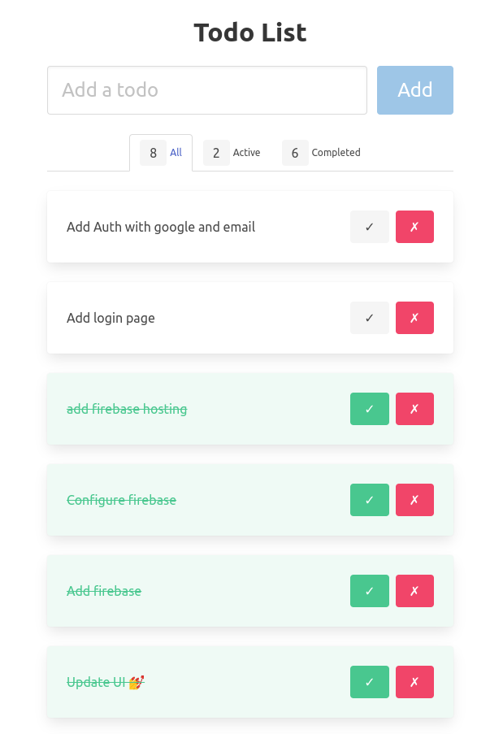

<!-- PROJECT SHIELDS -->
<!--
*** This template uses markdown "reference style" links for readability.
*** Reference links are enclosed in brackets [ ] instead of parentheses ( ).
*** See the bottom of this document for the declaration of the reference variables
*** for contributors-url, forks-url, etc. This is an optional, concise syntax you may use.
*** https://www.markdownguide.org/basic-syntax/#reference-style-links
-->

# Todos Web app

[![Contributors][contributors-shield]][contributors-url] [![Forks][forks-shield]][forks-url] [![Stargazers][stars-shield]][stars-url] [![Issues][issues-shield]][issues-url] [![MIT License][license-shield]][license-url] [![build-shield]][build-url]

<!-- ABOUT THE PROJECT -->

## About The Project

This is a simple project that I made to practice and learn about [bulma.io](https://bulma.io/) (Open Source CSS Library), [firebase](https://firebase.google.com/) and [Vue 3](https://vuejs.org/). I wanted to make a simple web app that would show a todos list to help you make things done. I also wanted to make it responsive so that it would look good on mobile devices.

Also I wanted to make it as simple as possible so that I could learn more about the technologies I used.



### Built With

- 🌲 [Vuejs 3](https://vuejs.org/)
- ⚡️ [Vite](https://vitejs.dev/)
- 💪 [Typescript](https://www.typescriptlang.org/)
- 💻 [VSCode](https://code.visualstudio.com/)
- 📦 [Pnpm](https://pnpm.io/)
- 🎨 [Bulma](https://bulma.io/)
- 🚀 [Firebase](https://firebase.google.com/)
- 📱 [Responsive](https://bulma.io/documentation/modifiers/responsive-helpers/)

<!-- GETTING STARTED -->

## Getting Started

To get a local copy up and running follow these simple steps.

### Recommended IDE Setup

[VSCode](https://code.visualstudio.com/) + [Volar](https://marketplace.visualstudio.com/items?itemName=Vue.volar) (and disable Vetur) + [TypeScript Vue Plugin (Volar)](https://marketplace.visualstudio.com/items?itemName=Vue.vscode-typescript-vue-plugin).

### Prerequisites

This is an example of how to list things you need to use the software and how to install them.

- Git

```sh
sudo apt-get install git
```

- Pnpm

```sh
sudo npm install -g pnpm
```

- Vue CLI

```sh
sudo npm install -g @vue/cli
```

### Installation

1. Clone the repo

```sh
git clone https://github.com/hectorromerodev/todo-fire-vue.git
```

2. Install Dependencies

```sh
# If you dont have pnpm installed
npm install -g pnpm

# If you already have pnpm installed
pnpm install
```

3. Run the project

```sh
pnpm run dev
```

4. Build the project

```sh
pnpm run build
```

<!-- USAGE EXAMPLES -->

## Usage

💡 You can use this project to create your own todo app with other technologies, features or integrations.

_For more examples, please refer to the Website [Case Study](https://channels.hr-webdev.com) from [hr-webdev.com](https://hr-webdev.com) Twt: [hectorromerodev](https://twitter.com/hectorromerodev)_

<!-- CONTACT -->

## Contact

Hector Romero - [@hectorromerodev](https://twitter.com/hectorromerodev)

Project Link: [Live Todo App](https://todo-e99d3.web.app/)

## Acknowledgements

- <a href="https://www.flaticon.com/free-icons/to-do" title="to do icons">To do icons created by Arkinasi - Flaticon</a>

- Icons made by <a href="https://www.flaticon.com/authors/pixel-perfect" title="Pixel perfect">Pixel perfect</a> from <a href="https://www.flaticon.com/" title="Flaticon">www.flaticon.com</a>

<!-- MARKDOWN LINKS & IMAGES -->
<!-- https://www.markdownguide.org/basic-syntax/#reference-style-links -->

[contributors-shield]: https://img.shields.io/github/contributors/hectorromerodev/todo-fire-vue.svg?style=flat-square
[contributors-url]: https://github.com/hectorromerodev/todo-fire-vue/graphs/contributors
[forks-shield]: https://img.shields.io/github/forks/hectorromerodev/todo-fire-vue.svg?style=flat-square
[forks-url]: https://github.com/hectorromerodev/todo-fire-vue/network/members
[stars-shield]: https://img.shields.io/github/stars/hectorromerodev/todo-fire-vue.svg?style=flat-square
[stars-url]: https://github.com/hectorromerodev/todo-fire-vue/stargazers
[issues-shield]: https://img.shields.io/github/issues/hectorromerodev/todo-fire-vue.svg?style=flat-square
[issues-url]: https://github.com/hectorromerodev/todo-fire-vue/issues
[license-shield]: https://img.shields.io/github/license/hectorromerodev/todo-fire-vue.svg?style=flat-square
[license-url]: LICENSE
[build-shield]: https://github.com/hectorromerodev/todo-fire-vue/actions/workflows/firebase-hosting-merge.yml/badge.svg?branch=main
[build-url]: https://github.com/hectorromerodev/todo-fire-vue/actions/workflows/firebase-hosting-merge.yml